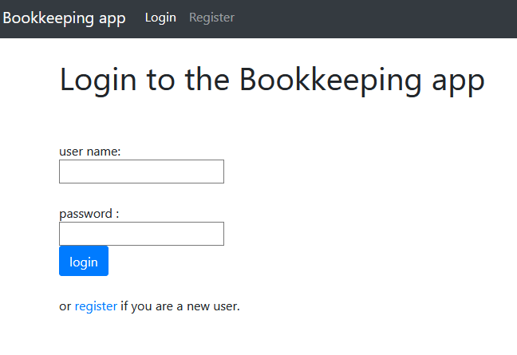
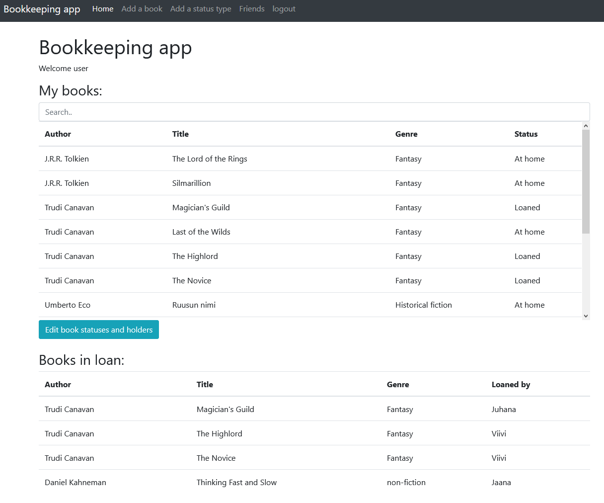
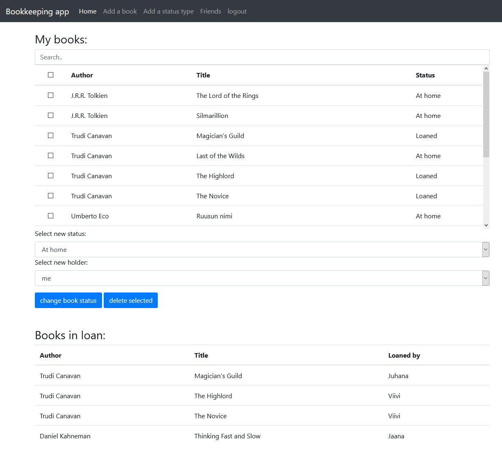
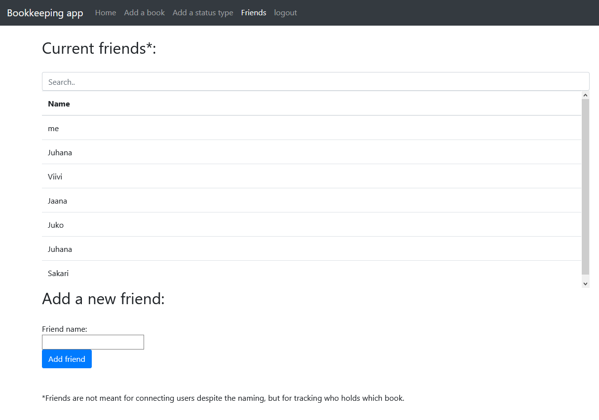
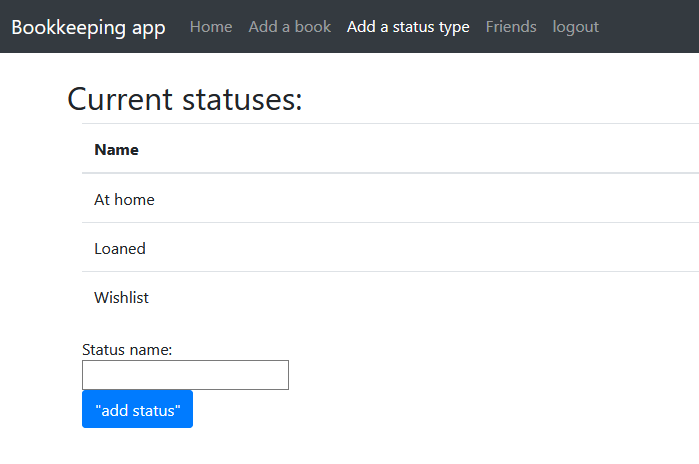
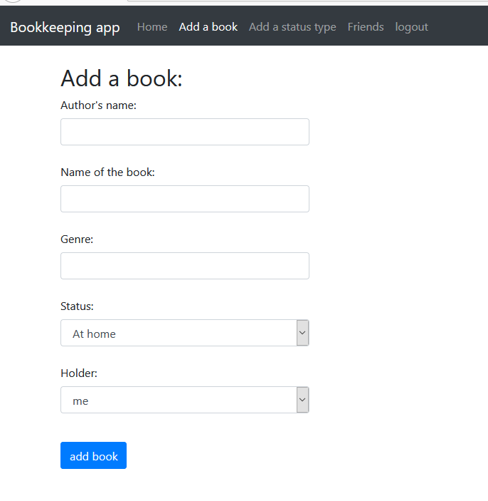

# bookkeeping

Bookkeeping is a system for keeping track of books owned and loaned. It is easy to forget having loaned a book to a friend and who currently has what book. It can also be used to keep an inventory of books, listing books not yet read and having a wishlist for books.

Functionalities:
* The user can sign in and register a new user account
* The user can add new book titles or delete them from the system
* The user can change the status of a book (e.g. read, on wishlist, loaned, to be read, currently reading)
* The user can add the names of their friends to the system
* The user can mark books as being loaned by one of their friends
* The user can list and search books in the system based on title, genre, person or status

 
Testing: 
heroku link: 
https://tsohabookkeeping.herokuapp.com/  

## user manual:
Going to https://tsohabookkeeping.herokuapp.com/ you will first see the login screen:

As this is your first time in the system, you will have to create a new account by clicking the register button. A similar view will appear letting you create new account. After that you will have to login.

After loggin in you will see the main view as shown below. The tables will be empty at first before you add books. It's possible to search through the books by typing in the search field. On top there's a navigation bar for the different views. There is also a separate table below for viewing loaned books. Book status and holder can be edited by clicking the button below the table, which will bring the next view:

In this view you can select books from the table and then either delete them, or choose new status and holder.

The friends view can be used to add new names to the system. This is not a friend system as such, but used for adding new names for keeping track of books. Name here could as well be library, bookshop or a person.

This view can be used to add new statuses to the system. If I would have had time, I would have put this behind admin account. The statuses are visible for everyone.

This view is used for adding new books to the system. Just write the requested things, and the book will be added. Empty or too long values are not accepted.

